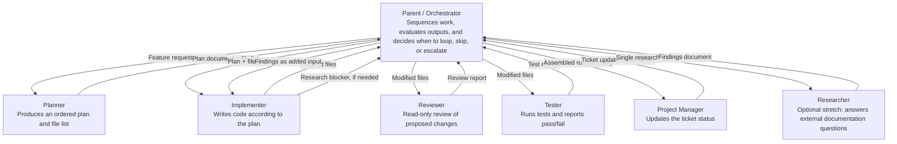

# Orchestration Diagram - CSV Export Workflow

This file uses Mermaid because GitHub and GitLab can render Mermaid diagrams directly inside Markdown.

## Handoff summary

1. The parent invokes the `planner` with the feature request and repository path.
2. The parent sends the resulting plan and file list to the `implementer`.
3. The parent sends modified files to the `reviewer`.
4. The parent sends modified files to the `tester`.
5. The parent sends the assembled run summary to the `project-manager`.
6. In the optional stretch flow, the parent invokes the `researcher` only when another role raises an external-documentation blocker.
